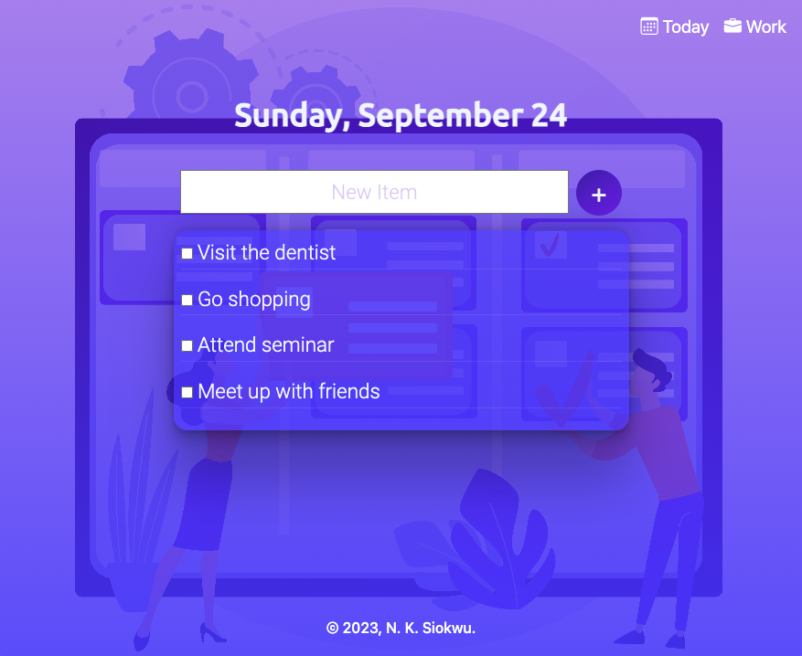
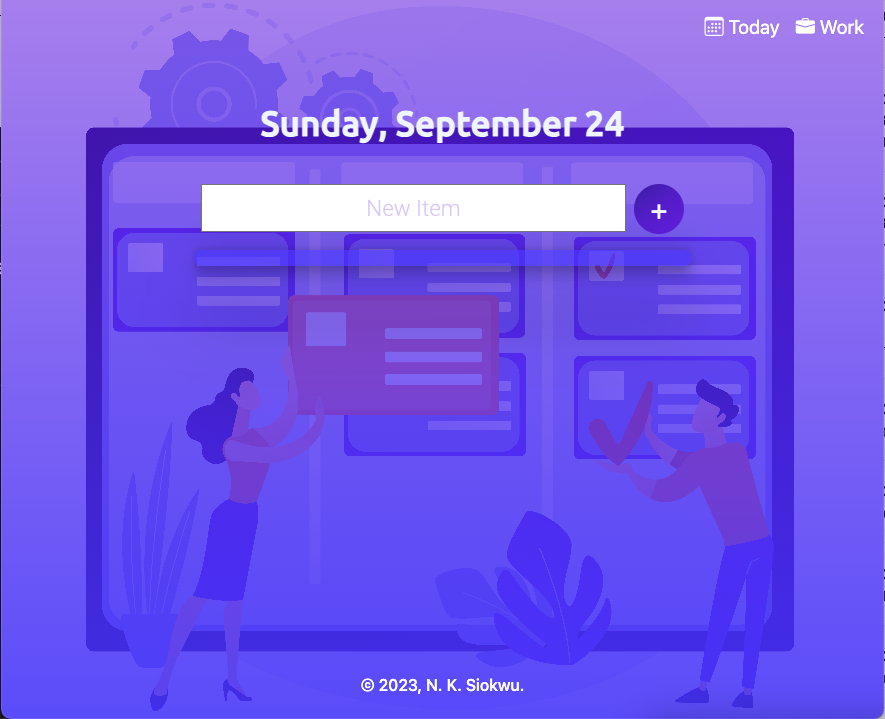

# ToDo-List-Web-App
This is a basic ToDo List web application which I have created using Node.js, Express.js and EJS. The application  allows users to add tasks to their todo list and strike out completed tasks.

## Technologies Used
* EJS
* Node.js
* Express
* JavaScript
* Bootstrap 5
* CSS
* HTML

## Screenshot

## Deployed Page

## Credits
* <a href="https://www.freepik.com/free-vector/task-management-abstract-concept-illustration_11668613.htm#query=todo&position=21&from_view=search&track=sph">Image by vectorjuice</a> on Freepik
